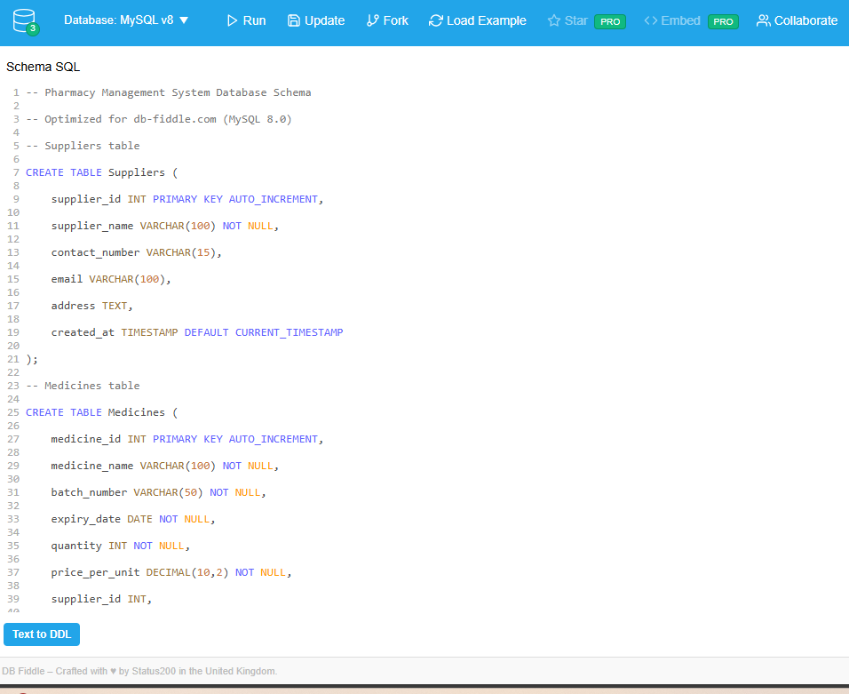

# 💊 Pharmacy Management System
A comprehensive **Database Management System (DBMS)** for pharmacy operations, developed as part of an academic project.

---

## 🎯 Project Overview
This system manages pharmacy inventory, sales, customers, suppliers, and prescriptions with automated stock tracking and reporting capabilities.

---

## 🗃️ Database Schema

**Entities**
- **Medicines:** Product inventory with expiry tracking  
- **Suppliers:** Medicine suppliers information  
- **Customers:** Customer profiles and history  
- **Sales:** Transaction records  
- **Sale_Details:** Individual sale items  
- **Prescriptions:** Customer prescriptions  

**Schema Design:**
> Visual representation of all database tables and their relationships.



---

## 🚀 Quick Start

### **Option 1: Run on db-fiddle.com (Recommended for Demo)**
You can instantly explore and test this project without local setup:  
👉 **[Open DB Fiddle](https://www.db-fiddle.com/f/4ZqUVyU8H7h266KzugAdSo/5)**  

**Steps:**
1. Select **MySQL 8.0** on [db-fiddle.com](https://www.db-fiddle.com)
2. Run the SQL files in this order:
   - `01_schema.sql`
   - `02_inserts.sql`
   - `03_views.sql`
   - `04_queries.sql`
   - `05_triggers.sql`

### **Option 2: Local MySQL Setup**
```bash
# Import complete database
mysql -u username -p < database/pharmacy_db_backup.sql
📊 Key Features
✅ Inventory Management with Expiry Tracking
✅ Sales and Billing System
✅ Customer Relationship Management
✅ Supplier Performance Analytics
✅ Automated Stock Alerts
✅ Prescription Management
✅ Comprehensive Reporting

🔍 Sample Queries
1. Get Expiring Medicines
sql
Copy code
SELECT * FROM ExpiringMedicinesView;
Result:

2. Top Selling Products
sql
Copy code
SELECT * FROM TopSellingMedicinesView LIMIT 5;
Result:

🖥️ DB Fiddle Interface
Demonstration of the online MySQL environment used for testing and validation.


📁 Project Structure
pgsql
Copy code
DBMS-Pharmacy-Management/
├── sql/           # All SQL scripts
├── screenshots/   # Query results and schema
├── docs/          # PBL documentation
└── database/      # Complete database backup
📄 License
Academic Project — MIT License

🧾 Documentation
/docs/Project-Report.docx should include:

Problem Statement

Literature Review

System Analysis

ER Diagrams

Normalization Proofs

Implementation Details

Screenshots and Results

Conclusion and Future Work

📸 Screenshots Summary
Schema Design: screenshots/schema-design.png

Query Results:

screenshots/query-results-1.png

screenshots/query-results-2.png

DB Fiddle Interface: screenshots/db-fiddle-interface.png

