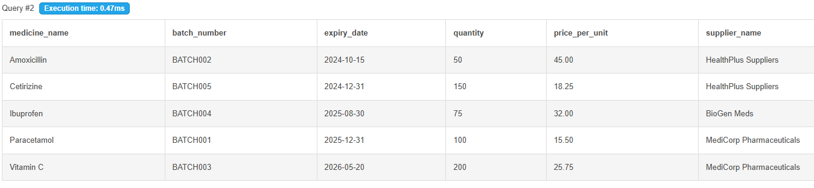
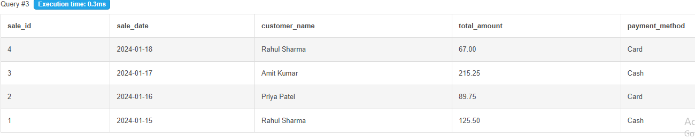
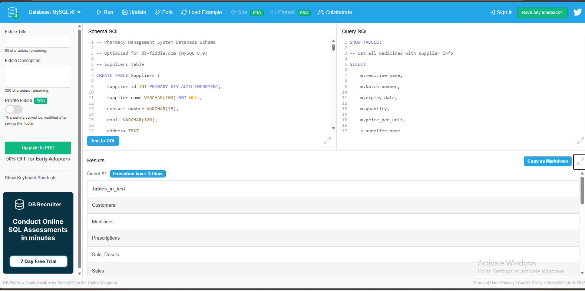

# 💊 Pharmacy Management System

A comprehensive **Database Management System (DBMS)** for pharmacy operations, developed as part of the **DBMS Lab Academic Project**.

---

## 🎯 Project Overview

This system manages **pharmacy inventory, sales, customers, suppliers, and prescriptions** with automated stock tracking and reporting capabilities.  
It is designed to streamline pharmacy workflows and maintain efficient database-driven operations.

---

## 🗃️ Database Schema

### Entities

- **Medicines**: Product inventory with expiry tracking  
- **Suppliers**: Medicine suppliers information  
- **Customers**: Customer profiles and purchase history  
- **Sales**: Transaction records  
- **Sale_Details**: Individual sale items  
- **Prescriptions**: Customer prescriptions  

---

## 🧩 Schema Design

Below is the visual representation of the schema used in the project:

[](screenshots/schema-design.png)

---

## 🧪 Sample Queries & Results

### 🔹 Query 1: Get All Medicines with Supplier Information  
```sql
SELECT 
    m.medicine_name,
    m.batch_number,
    m.expiry_date,
    m.quantity,
    m.price_per_unit,
    s.supplier_name
FROM Medicines m
JOIN Suppliers s ON m.supplier_id = s.supplier_id
ORDER BY m.medicine_name;
````

[](screenshots/query-results-1.png)

---

### 🔹 Query 2: Sales Report with Customer Details

```sql
SELECT 
    s.sale_id,
    s.sale_date,
    c.customer_name,
    s.total_amount,
    s.payment_method
FROM Sales s
JOIN Customers c ON s.customer_id = c.customer_id
ORDER BY s.sale_date DESC;
```

[](screenshots/query-results-2.png)

---

## 🌐 DB Fiddle Interface

Run and test this project directly on **db-fiddle.com**
👉 [**View Live Demo**](https://www.db-fiddle.com/f/4ZqUVyU8H7h266KzugAdSo/5)

[](screenshots/db-fiddle-interface.png)

---

## 🚀 Quick Start

### Option 1: Using db-fiddle.com (Recommended for Demo)

1. Visit **[db-fiddle.com](https://www.db-fiddle.com/f/4ZqUVyU8H7h266KzugAdSo/5)**
2. Select **MySQL 8.0**
3. Run the SQL files in this order:

   * `01_schema.sql`
   * `02_inserts.sql`
   * `03_views.sql`
   * `04_queries.sql`
   * `05_triggers.sql`

### Option 2: Local MySQL Setup

```bash
# Import complete database
mysql -u username -p < database/pharmacy_db_backup.sql
```

---

## 📊 Key Features

✅ Inventory Management with Expiry Tracking
✅ Sales and Billing System
✅ Customer Relationship Management
✅ Supplier Performance Analytics
✅ Automated Stock Alerts
✅ Prescription Management
✅ Comprehensive Reporting

---

## 📋 Sample Queries

**Show Tables**

```sql
SHOW TABLES;
```

**Get Medicines with Supplier Info**

```sql
SELECT 
    m.medicine_name,
    m.batch_number,
    m.expiry_date,
    m.quantity,
    m.price_per_unit,
    s.supplier_name
FROM Medicines m
JOIN Suppliers s ON m.supplier_id = s.supplier_id
ORDER BY m.medicine_name;
```

**Sales Report with Customer Details**

```sql
SELECT 
    s.sale_id,
    s.sale_date,
    c.customer_name,
    s.total_amount,
    s.payment_method
FROM Sales s
JOIN Customers c ON s.customer_id = c.customer_id
ORDER BY s.sale_date DESC;
```

---

## 📁 Project Structure

```
DBMS-Pharmacy-Management/
├── sql/           # All SQL scripts
├── screenshots/   # Query results and schema
├── docs/          # PBL documentation
└── database/      # Complete database backup
```

---

## 🎯 db-fiddle.com Instructions

**Why use db-fiddle.com?**

* No installation required
* Instant demonstration capability
* Shareable link for evaluation
* Supports all MySQL features used
* Perfect for academic presentations

**How to Present:**

1. Open **db-fiddle.com**
2. Choose **MySQL 8.0**
3. Paste and run each file sequentially (`schema`, `inserts`, `views`, `queries`, `triggers`)
4. Save the fiddle and share the permanent link with your lecturer

---

## 📄 License

**Academic Project — MIT License**

---

## 📚 Additional Files

### `/docs/Project-Report.docx`

---

## 🖼️ Screenshots Summary

| Screenshot                                        | Description                                       |
| ------------------------------------------------- | ------------------------------------------------- |
|           | Database Schema Design                            |
|        | Query Result – Medicines with Supplier Info       |
|        | Query Result – Sales Report with Customer Details |
|  | db-fiddle Interface                               |

---

### 🌟 Developed by:

**Enzo Farai**
*BCA – Chandigarh University*
📘 Academic DBMS Project

